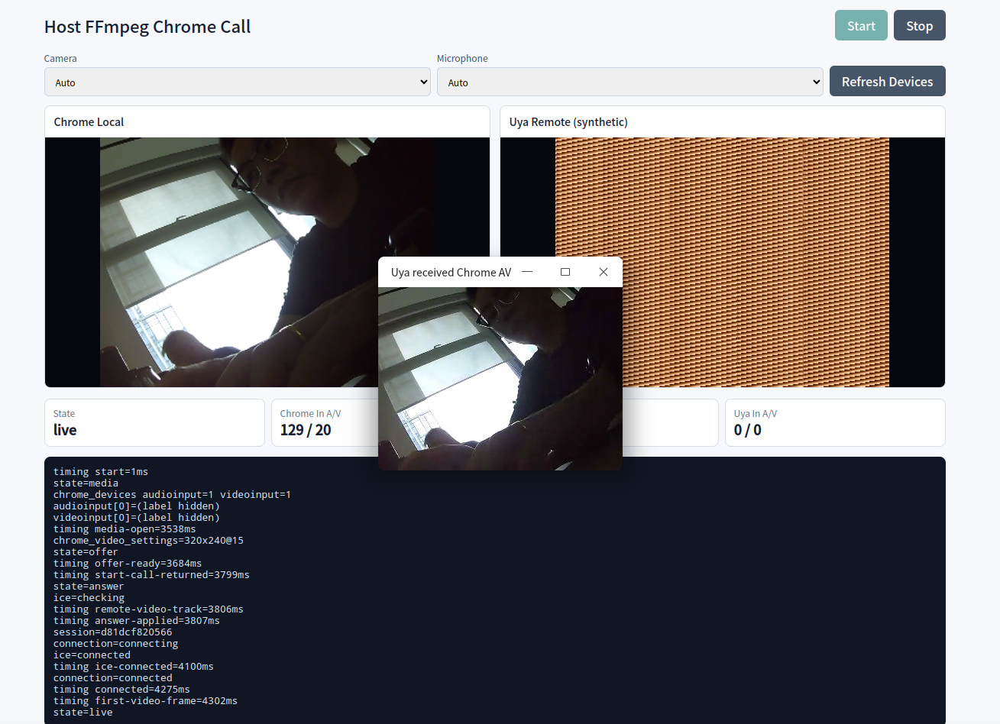

# 纯 Uya WebRTC v0.3.0：Chrome direct media PeerConnection 里程碑

Uya WebRTC 发布了 `v0.3.0` 里程碑版本。这个版本继续沿着“默认运行路径用 Uya 实现 WebRTC transport”的方向推进，把通用 PeerConnection 从 DataChannel-only 的验证边界推进到 Chrome video SDP、SRTP/VP8 RTP 接收路由和 host FFmpeg Chrome call 手工互通。



## Uya 简介

Uya 是一个正在演进中的系统编程语言和工具链，目标是面向底层、网络、嵌入式和高性能服务场景，提供接近 C/C++ 的控制力，同时把模块、错误处理、泛型、异步、标准库和构建体验做成更适合工程协作的形态。

在这个 WebRTC 项目里，Uya 主要承担三类工作：

- 协议和状态机：SDP、ICE、STUN/TURN、DTLS、SRTP/SRTCP、RTP/RTCP、SCTP DataChannel、PeerConnection、stats/trace。
- 热路径数据结构：固定容量 buffer、arena、ring queue、packet clone budget、jitter/reassembly、pacer。
- 跨平台边界：默认不复用 libwebrtc、BoringSSL、usrsctp、libsrtp、libvpx 或 libopus 的运行时对象，只在 socket、clock、线程、epoll 等 OS 能力处保留薄 FFI。

本仓库还把 `./uya/bin/uya` 和 `./uya/lib` 纳入发布验证，确保 release gate 使用仓库内的 Uya 编译器和标准库快照，而不是依赖开发机上的 sibling checkout。

## 这次 v0.3.0 做了什么

### 1. PeerConnection 进入 Chrome video 验证

`v0.3.0` 增加了 PeerConnection 层的 video media section、`addTransceiver`、`addTrack`、`processSrtpPacket` 和 `routeVideoFrame` 路径。对应 gate 是：

```sh
UYA=./uya/bin/uya bash tests/check_phase14_peer_connection_chrome_video.sh
```

这个 gate 验证的不只是代码存在，还会编译并运行 `src/webrtc_peer_connection_chrome_video_test_main.uya`，确认 Chrome video SDP 和 SRTP/VP8 RTP 接收路由能走通。

### 2. Host FFmpeg Chrome Call 可手工预览

`make host-ffmpeg-chrome-call` 提供一个本机浏览器互通页面。页面左侧是 Chrome 本地采集，右侧是 Uya remote synthetic video，中间还能打开 Uya 收到的 Chrome A/V 播放窗口。页面下方输出 timing、ICE 状态、首帧耗时和 RTP 计数，便于区分“只是发包了”和“浏览器真的解码了”。

启动方式：

```sh
make host-ffmpeg-chrome-call UYA=./uya/bin/uya
```

发布验证中使用了短时 smoke：

```sh
timeout 15s make host-ffmpeg-chrome-call UYA=./uya/bin/uya HOST_CALL_DURATION_US=3000000 HOST_CALL_PORT=0
```

该入口是显式 reference codec / 手工互通入口。FFmpeg 用于 host 侧 codec 和设备接入验证，不进入默认 runtime。

### 3. FFmpeg Chrome call E2E gate

本版本继续保留并加强 Chrome direct call 验证：

```sh
UYA=./uya/bin/uya make test-ffmpeg-chrome-call
```

该 gate 覆盖：

- FFmpeg codec extern boundary。
- direct sender RTP/SRTP/SRTCP packetizer。
- DTLS/STUN/SRTP/SRTCP runtime 控制包处理。
- playback smoke。
- synthetic manual preview。
- 1080p MP4 manual preview。
- Chrome direct call 的 audio/video RTP 与 decoded frames 统计。

### 4. 发布验证使用仓库内 Uya

发布记录明确使用：

```sh
./uya/bin/uya --version
UYA=./uya/bin/uya make test
UYA=./uya/bin/uya make test-ffmpeg-chrome-call
```

当前仓库内编译器版本输出为：

```text
v0.10.0
```

## 适合关注什么

这个版本适合关注以下方向：

- 纯 Uya WebRTC transport 的协议边界如何拆分。
- PeerConnection 层如何从 DataChannel-only 走向音视频 media section。
- 不依赖 libwebrtc 的情况下，如何逐步建立 Chrome 互通 gate。
- 如何把 host reference codec 和默认 runtime 边界分开，既能验证互通，又不把 FFmpeg 变成默认依赖。
- RK1106/RV1103B 这类板端 H264/G711 推流示例如何复用同一套 WebRTC transport。

## 已知限制

- 通用 PeerConnection 还不是完整生产级浏览器 P2P 音视频 API；采集、发送和手工互通主要由 direct sender / 示例入口承接。
- FFmpeg 仍是显式 reference codec / host interop 测试边界，不进入默认 runtime。
- 纯 Uya Opus codec bridge、`../vp8` UPM path dependency、跨平台 CI matrix 仍在推进中。
- RK1106 板端真实链路依赖 Rockchip SDK、MPI、VENC/AENC、AI 设备和现场网络环境。

## 参考地址

- 项目仓库：https://github.com/uya-lang/webrtc
- README：https://github.com/uya-lang/webrtc/blob/main/README.md
- v0.3.0 版本说明：https://github.com/uya-lang/webrtc/blob/main/docs/release-v0.3.0.md
- Changelog：https://github.com/uya-lang/webrtc/blob/main/CHANGELOG.md
- 设计文档：https://github.com/uya-lang/webrtc/blob/main/docs/design.md
- TODO / 阶段拆解：https://github.com/uya-lang/webrtc/blob/main/docs/todo.md
- 截图路径：https://github.com/uya-lang/webrtc/blob/main/asserts/img/ffmpeg_chrom_live_call.png
